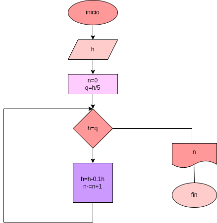

# ejercicio 4 - rebote de una pelota

## discripcion 
una pelota se deja caer desde una altura inicial  h.
en cada rebote la pelota alcanza una altura de 10% menor que la del rebote anterior

el programa debe leer la altura inicial y calcular en que rebote la pelota deja de alcanzar la quinta parte de la altura inicial 

## funcionamiento
1. El usuario ingresa la altura inicial
2. se calcula la quinta parte de esa altura
3. en cada rebote la altura nueva es del 90% de la anterior
4. el proceso se repite usando un cliclo while
5. cuando la altura es menor que la quinta parte de la inicial, el programa muestra el numero de rebote

